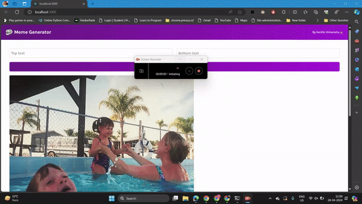

# Meme Generator

## Overview
Meme Generator is a web application built with HTML5, CSS3, and ReactJS that allows users to generate memes using images fetched from an API. This project provides a fun and easy way to create and share humorous memes with friends and family.

## Features
- Fetches meme images from an API
- Allows users to customize text on memes
- Provides a user-friendly interface for meme creation
- Easy to share memes on social media platforms

## Tech Stack
- HTML5
- CSS3
- ReactJS

## Demo
Here's a brief overview of how the Meme Generator works:

## Installation
To run the Meme Generator locally, follow these steps:

1. Clone the repository:
   
   git clone https://github.com/himanshugupta09/Meme-Generator-App.git
   
2.Navigate to the project directory:
   cd Meme-Generator
   
3. Install dependencies:
   npm install

4. Start the development server:
    npm start
   
6. Open your web browser and visit http://localhost:3000 to use the Meme Generator.

## Contributing
  Contributions are welcome! If you'd like to contribute to the project, please follow these guidelines:
  - Fork the repository
  - Create a new branch (git checkout -b feature)
  - Make your changes and commit them (git commit -am 'Add new feature')
  - Push to the branch (git push origin feature)
  - Create a pull request

## License
   This project is licensed under the MIT License.

Feel free to reach out if you have any questions or feedback!
   
